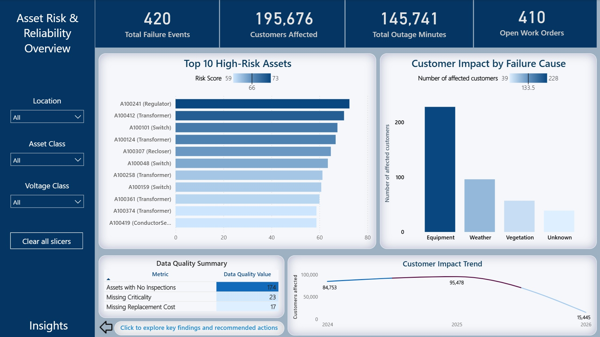
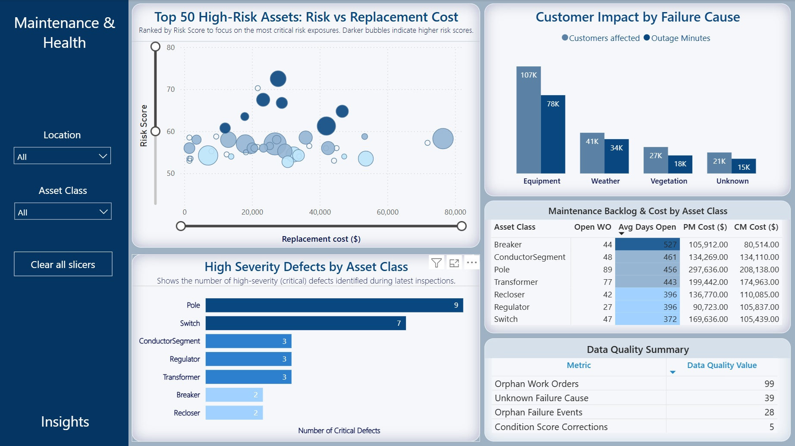

# Asset-Risk-Reliability-Analytics-Dashboard-Power-BI
End-to-end Power BI project focused on asset risk management, maintenance reliability, and operational performance analytics for utility-style infrastructure environments.  

## The project was designed to simulate how data-driven asset management can support maintenance prioritization, reliability improvement, and long-term operational planning.

### Key areas of analysis included:

🔹 Asset Risk Scoring
🔹 Failure Event Analysis
🔹 Maintenance Backlog Monitoring
🔹 Customer Impact & Outage Analytics
🔹 Preventive vs Corrective Maintenance Costs
🔹 Data Quality & Asset Integrity Monitoring
🔹 Risk vs Replacement Cost Prioritization

Using Power BI, DAX, SQL, and data modeling techniques, I built interactive dashboards that help transform operational data into actionable insights for maintenance and asset management teams.

### Some insights identified during the analysis:

✔️ Equipment-related failures were the primary driver of customer interruptions
✔️ High-risk assets were concentrated among aging infrastructure classes
✔️ Maintenance backlog patterns revealed both aging-related and volume-driven operational risks
✔️ Data quality gaps significantly impacted risk visibility and decision accuracy

### This project strengthened my experience in:

📊 Data visualization & dashboard development
📈 Risk-based operational analytics
🛠️ Asset lifecycle & reliability analysis
📉 Maintenance performance reporting
🧩 Data quality assessment
⚡ Utility-focused operational intelligence

### Watch the full report via the link:

https://app.powerbi.com/view?r=eyJrIjoiMzQ4ZjA4MGMtMmFjMC00MmMwLWE3NzItZTZkMDM0ZTc4Njc2IiwidCI6IjY1NWVhZjVhLTBhMTctNDEzOS05NzU5LTFlMDIzMTRkMDJhYiIsImMiOjZ9

## Key dashboards

### Asset-Risk-Reliability-Analytics_Architecture_(Power_BI)

### Overview

### Maintenance and Health

